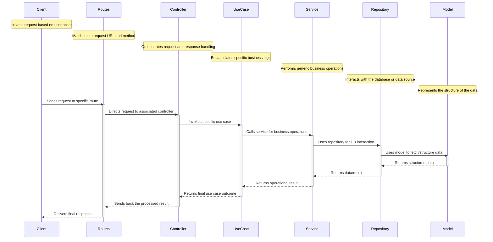

# List of features implemented
##  Custom logger
    - try bunyan
## Middlewares  
    - security headers
    - request & response logging
    - response time    
## Database - Postgresql
    - Indexing
    - Full Text search  
## ORM - Sequelize
### Associations in sequelize:
    - `Sequelize` supports the standard associations: One-To-One, One-To-Many and Many-To-Many.
    - To do this, Sequelize provides four types of associations that should be combined to create them:
        1. The `HasOne` association
        1. The `BelongsTo` association
        1. The `HasMany` association
        1. The `BelongsToMany` association
    - Here's a tabular breakdown to map the standard relationships with their Sequelize functions:
        | Relationship Type | Source Model (A)       | Target Model (B)       | Notes/Comments                                             |
        |-------------------|------------------------|------------------------|------------------------------------------------------------|
        | One-To-One        | `A.hasOne(B)`          | `A.belongsTo(B)`       | Foreign key added to the target model (B).                 |
        | One-To-Many       | `A.hasMany(B)`         | `A.belongsTo(B)`       | Foreign key added to the target model (B).                 |
        | Many-To-Many      | `A.belongsToMany(B, { through: 'C' })` | `B.belongsToMany(A, { through: 'C' })` | Uses a junction table 'C'. Sequelize will auto-generate model C if not defined. |

1. For **One-To-One** relationships:
    - The source model (A) has one target (B).
    - The target model (B) belongs to the source (A).
    - This effectively sets a foreign key in the target model (B) pointing to the source model (A).

1. For **One-To-Many** relationships:
    - The source model (A) has many of the target (B).
    - Each target model (B) instance belongs to one source (A).
    - This effectively sets a foreign key in the target model (B) pointing to the source model (A).

1. For **Many-To-Many** relationships:
    - Both models are related to each other using a junction table (often named 'C' or a more descriptive name).
    - This table 'C' holds foreign keys that point to the IDs in both the source (A) and target (B) models.

1. Example Associations: Albums - Songs - Artists 
    1. *Artist* - `Many-to-Many` - *Album* via junction table `artist_album`:
        ```js
        Artist.belongsToMany(Album, { through: ArtistAlbum });
        Album.belongsToMany(Artist, { through: ArtistAlbum });
        ```
    1. *Artist* - `Many-to-Many` - *Song* via junction table `artist_song`:
        ```js
        Artist.belongsToMany(Song, { through: ArtistSong });
        Song.belongsToMany(Artist, { through: ArtistSong });
        ```
    1. *Album* - `One-to-Many` - *Song*:
        ```js
        Album.hasMany(Song, { foreignKey: 'album_slug' });
        Song.belongsTo(Album, { foreignKey: 'album_slug' });        
        ```
1. In Sequelize CLI, junction tables for Many-to-Many relationships are not automatically generated when running migrations.
```sh
    $ npx sequelize-cli model:generate --name Singers --attributes artist_slug:string,song_slug:string
    $ npx sequelize-cli model:generate --name Lyricists --attributes artist_slug:string,song_slug:string
    $ npx sequelize-cli model:generate --name MusicDirectors --attributes artist_slug:string,song_slug:string
``` 
1. SQL Queries
    ```sql
        SELECT * FROM "Albums" JOIN "Songs" ON "Songs"."album_slug" = "Albums".slug;
    ```
### Migrations & Seeding using sequelize-cli

The Sequelize Command-Line Interface (CLI) is a useful tool for managing your database schema and seeding data. Here are some of the basic commands for migration and seeding:
### Configuring Sequelize CLI
- update the config file to config.js to read from env variables
- update `.sequelizerc`  to execute the sequelize cmds from any folder
```bash
# install Sequelize CLI
npm install --save-dev sequelize-cli
# Initialize Sequelize - This will create necessary folders and files for your project:
npx sequelize-cli init
# @~/coding/js_coding/backend/node-trailers/vermittler/database
$ npx sequelize --help
$ npx sequelize-cli --version

```

### Migrations

```bash
    # To generate a new migration file:
    npx sequelize-cli migration:generate --name=name-of-migration
    # To apply all pending migrations:
    npx sequelize-cli db:migrate
    # To revert the last migration:
    npx sequelize-cli db:migrate:undo
    # To revert all migrations:
    npx sequelize-cli db:migrate:undo:all
```
####  step-by-step guide to create migrations for albums, songs, artists

1. Create model and migration for Album
    >  @ ~/coding/js_coding/backend/node-trailers/vermittler
    > $ npx sequelize-cli model:generate --name Album --attributes title:string,slug:string,language:string,year:integer

1. Create model and migration for Song
    > $ npx sequelize-cli model:generate --name Song --attributes title:string,slug:string,summary:json,lyrics:json 
1. set `slug` field to be unique in create-song & create-album migrations
    > unique: true
1. Define associations in the models & migrations for Album and Song (One to Many)
```js
    //@ ~/vermittler/database/models/album.js
    Album.hasMany(models.Song, { foreignKey: 'album_slug', sourceKey: 'slug' });
    //@ ~/vermittler/database/models/song.js
    Song.belongsTo(models.Album, { foreignKey: 'album_slug', targetKey: 'slug' });
    // @ ~/vermittler/database/migrations/20230904115941-create-song.js
    // add the foreign key
    album_slug: {
        type: Sequelize.STRING,
        references: {
          model: 'Albums',
          key: 'slug'
        },
        // onDelete: 'CASCADE'
      },
```
1. try to create the tables for album and song in the database using the migrations
```sh
    $ npx sequelize-cli db:migrate --name 20230904115646-create-album
    $ npx sequelize-cli db:migrate --name 20230904115941-create-song
```
1. seed the models with some data
```sh
    $ npx sequelize-cli db:seed --seed 20230827164825-demo-album.js
    $ npx sequelize-cli db:seed --seed 20230827152935-demo-song.js
    # to generate the seed files:
    # $ npx sequelize-cli seed:generate --name demo-song
```
1. create junction tables for the Many-to-Many relationships
    > $ npx sequelize-cli model:generate --name ArtistSungSongs --attributes artist_slug:string,song_slug:string
    > $ npx sequelize-cli model:generate --name ArtistWrittenSongs --attributes artist_slug:string,song_slug:string
    > $ npx sequelize-cli model:generate --name ArtistComposedSongs --attributes artist_slug:string,song_slug:string

1. try to query the database using the models
```js
    $ node database/query.js
```


$ npx sequelize-cli model:generate --name ArtistAlbum --attributes artist_slug:string,album_slug:string
# db:migrate will create the table in the database
$ npx sequelize-cli db:migrate
# db migrate specific migration
$ npx sequelize-cli db:migrate --name 20230821084444-create-artist
$ npx sequelize-cli db:migrate --name 20230827152309-create-song
$ npx sequelize-cli db:migrate --name 20230827164349-create-album
# undo the last migration
$ npx sequelize-cli db:migrate:undo 
# undo the specific migration
$ npx sequelize-cli db:migrate:undo --name 20230817052134-create-user
# This will create xxx-migration-skeleton.js in your migration folder
$ npx sequelize-cli migration:generate --name <name_of_your_migration>
# This will:
    # - Create a model file user in models folder;
    # - Create a migration file with name like XXXXXXXXXXXXXX-create-user.js in migrations folder.
# $ npx sequelize-cli model:generate --name User --attributes firstName:string,lastName:string,email:string

### Seeding

```sh
    # To generate a new seed file:
    npx sequelize-cli seed:generate --name=name-of-seed
    # To apply all seeders:
    npx sequelize-cli db:seed:all
    # To revert the last seed:
    npx sequelize-cli db:seed:undo
    # To revert all seeds:
    npx sequelize-cli db:seed:undo:all
```
- Creating the first Seed
```sh
    $ npx sequelize-cli seed:generate --name demo-artist
    $ npx sequelize-cli seed:generate --name demo-song
    $ npx sequelize-cli seed:generate --name demo-album
    # $ npx sequelize-cli seed:generate --name demo-user
    # This will create a seed file with name like XXXXXXXXXXXXXX-demo-user.js in seeders folder.
```
- Edit the seed file to insert a demo user
```sh
    # to run the seeds - commits to db
    $ npx sequelize-cli db:seed:all
    # to undo the seeds all, specific, most-recent
    $ npx sequelize-cli db:seed:undo:all
    $ npx sequelize-cli db:seed:undo --seed <name-of-seed-as-in-data>
    

    
```
- (TODO) use `queryInterface.sequelize.transaction` in migrations

### Sequence of steps to create models, associations, migrations, seeds
1. Create the models without associations
```sh
    # Artist model
    $ npx sequelize-cli model:generate --name Artist --attributes name:string,slug:string --force 
    # Song model
    $ npx sequelize-cli model:generate --name Song --attributes title:string,slug:string,summary:json,lyrics:json,native_lyrics:json
    # Album model
    $ npx sequelize-cli model:generate --name Album --attributes title:string,slug:string,language:string,year:integer,summary:json
    # ArtistSungSongs model
    $ npx sequelize-cli model:generate --name ArtistSungSongs --attributes artistId:integer,songId:integer
    # ArtistLyricistSongs model
    $ npx sequelize-cli model:generate --name ArtistLyricistSongs --attributes artistId:integer,songId:integer
    # ArtistMusicDirectorSongs model
    $ npx sequelize-cli model:generate --name ArtistMusicDirectorSongs --attributes artistId:integer,songId:integer

```

1. Run the migrations to create the tables
```sh
    $ npx sequelize-cli db:migrate --name 001-create-album.js
    $ npx sequelize-cli db:migrate --name 101-create-song.js
    $ npx sequelize-cli db:migrate --name 201-create-artist.js
    $ npx sequelize-cli db:migrate --name 102-create-song.js
```
1. Use the `queryInterface.addColumn` to add the foreign keys in the tables
1. Add associations manually in the models

1. Create the Junction Table
1. Run the migration for the junction table
1. Create the associations
1. Create the migrations
1. Create the seeds
```sh
    $ npx sequelize-cli db:seed --seed 20230827164825-demo-album.js
    $ npx sequelize-cli db:seed --seed 20230827152935-demo-song.js
    $ npx sequelize-cli db:seed --seed 20230817062507-demo-artist.js
```    
1. Run the migrations
1. Run the seeds


### Operator
`Sequelize.Op` is an object that contains a set of operators that can be used in Sequelize queries. Here are some basic use cases of `Sequelize.Op`:

- **Comparison operators**: `Sequelize.Op.eq`, `Sequelize.Op.ne`, `Sequelize.Op.gt`, `Sequelize.Op.gte`, `Sequelize.Op.lt`, `Sequelize.Op.lte`, `Sequelize.Op.between`, `Sequelize.Op.notBetween`, `Sequelize.Op.in`, `Sequelize.Op.notIn`, `Sequelize.Op.like`, `Sequelize.Op.notLike`, `Sequelize.Op.iLike`, `Sequelize.Op.notILike`, `Sequelize.Op.startsWith`, `Sequelize.Op.endsWith`, `Sequelize.Op.substring`, `Sequelize.Op.regexp`, `Sequelize.Op.notRegexp`, `Sequelize.Op.iRegexp`, `Sequelize.Op.notIRegexp`, `Sequelize.Op.overlap`, `Sequelize.Op.contains`, `Sequelize.Op.contained`, `Sequelize.Op.any`, `Sequelize.Op.all`, `Sequelize.Op.col`

- **Logical operators**: `Sequelize.Op.and`, `Sequelize.Op.or`, `Sequelize.Op.not`

- **Other operators**: `Sequelize.Op.is`, `Sequelize.Op.not`, `Sequelize.Op.or`, `Sequelize.Op.and`, `Sequelize.Op.literal`, `Sequelize.Op.json`, `Sequelize.Op.jsonPath`, `Sequelize.Op.jsonOverlap`, `Sequelize.Op.any`, `Sequelize.Op.all`, `Sequelize.Op.values`, `Sequelize.Op.cast`, `Sequelize.Op.placeholder`

- example
```js
    const { Op } = require('sequelize');
    const albums = await Album.findAll({
    where: {
        year: {
        [Op.gte]: 2000
        }
    }
    });
```

## Cache - Redis
## Rate limiting
## Authentication - jwt token
## Authorization 
## Unit tests
    - use of Mocha Framework
## serve static files
##  template html
## cookies & sessions
## Docker
## pm2 - use process manager to 
```sh
    $ pm2 reload ./ecosystem.config.js --only vermittler
    $ pm2 logs vermittler
    $ pm2 monit vermittler
    $ pm2 stop vermittler
    $ pm2 delete vermittler
    $ pm2 flush
```
## eslint - linting
## dotenv - environment variables
## Clean architecture 
- TODO: folder structure.
- Call flow in an clean architecture



### References
1. sequelize-cli & sequelize
    - https://sequelize.org/master/manual/migrations.html
    - https://youtu.be/M09nsCa4_Bk
    - https://youtu.be/4SySDaX753A
    - https://youtu.be/ikJ5AXDj3go
    - https://sequelize.org/docs/v6/category/core-concepts/
    - Associations 
        - https://sequelize.org/docs/v6/core-concepts/assocs/
        - https://sequelize.org/master/manual/assocs.html
    - Querying
        - https://levelup.gitconnected.com/using-the-sequelize-cli-and-querying-4ba8d0ac4314
1. pm2 
    - https://pm2.keymetrics.io/docs/usage/quick-start/
1. testing
    - https://dev-tester.com/dead-simple-api-tests-with-supertest-mocha-and-chai/