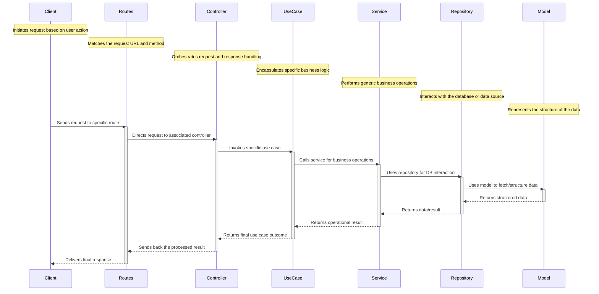

## List of features implemented
1. Custom logger - try bunyan
1. Middlewares  
    - security headers
    - request & response logging
    - response time
1. ORM - Sequelize
1. sequelize-cli to migrate & seed
    - update the config file to config.js to read from env variables
    - update `.sequelizerc`  to execute the sequelize cmds from any folder
    ```sh 
        # @~/coding/js_coding/backend/node-trailers/vermittler/database
        $ npx sequelize --help
        $ npx sequelize init
        $ npx sequelize-cli --version
        $ npx sequelize-cli db:migrate
    ```
    - `Creating the first Model (and Migration)`
    ```sh
       # @ ~/coding/js_coding/backend/node-trailers/vermittler
       $ npx sequelize-cli model:generate --name User --attributes firstName:string,lastName:string,email:string
       # This will:
        # - Create a model file user in models folder;
        # - Create a migration file with name like XXXXXXXXXXXXXX-create-user.js in migrations folder.
    ```
    - `Creating the first Seed`
    ```sh
        $ npx sequelize-cli seed:generate --name demo-user
        # This will create a seed file with name like XXXXXXXXXXXXXX-demo-user.js in seeders folder.
    ```
     - Edit the seed file to insert a demo user
     ```sh
        # to run the seeds - commits to db
        $ npx sequelize-cli db:seed:all
        # to undo the seeds all, specific, most-recent
        $ npx sequelize-cli db:seed:undo:all
        $ npx sequelize-cli db:seed:undo --seed <name-of-seed-as-in-data>
        $ npx sequelize-cli db:seed:undo --seed 20230817052308-demo-user.js
        $ npx sequelize-cli db:seed --seed 20230817062507-demo-artist.js
     ```
1. use `queryInterface.sequelize.transaction` in migrations

       

1. Database - Postgresql
1. Migrations
1. Seeds
1. Cache - Redis
1. Rate limiting
1. Authentication
1. Authorization
1. Unit tests
1. serve static files
1. template html
1. cookies & sessions
1. Docker
1. pm2 - use process manager to 
```sh
    # @~/cd
    $ pm2 reload ./ecosystem.config.js --only vermittler
    $ pm2 logs vermittler
    $ pm2 monit vermittler
    $ pm2 stop vermittler
```
1. eslint - linting
1. dotenv - environment variables
1. Clean architecture 
    - folder structure
    ```
       src/
        ├── app/
        │   ├── controllers/
        │   │   ├── blogPostController.js
        │   │   └── userController.js
        │   ├── middlewares/
        │   │   ├── authMiddleware.js
        │   │   └── errorMiddleware.js
        │   ├── routes/
        │   │   ├── blogPostRoutes.js
        │   │   └── userRoutes.js
        │   └── views/
        ├── config/
        │   ├── config.js
        │   └── database.js
        ├── core/
        │   ├── models/
        │   │   ├── BlogPost.js
        │   │   └── User.js
        │   ├── repositories/
        │   │   ├── BlogPostRepository.js
        │   │   └── UserRepository.js
        │   ├── services/
        │   │   ├── AuthService.js
        │   │   ├── BlogPostService.js
        │   │   └── UserService.js
        │   └── usecases/
        │       ├── AuthUseCases.js
        │       ├── BlogPostUseCases.js
        │       └── UserUseCases.js
        ├── database/
        │   ├── migrations/
        │   │   ├── 20220101000001-create-blog-post.js
        │   │   └── 20220101000002-create-user.js
        │   └── seeds/
        │       ├── 01-blog-posts.js
        │       └── 02-users.js
        └── interfaces/
            ├── http/
            │   ├── app.js
            │   └── server.js
            └── persistence/
                ├── BlogPostRepositoryImpl.js
                └── UserRepositoryImpl.js

    ```

    - Call flow in an clean architecture



### References
1. sequelize-cli 
    - https://sequelize.org/master/manual/migrations.html
    - https://youtu.be/M09nsCa4_Bk
    - https://youtu.be/4SySDaX753A
    - https://youtu.be/ikJ5AXDj3go