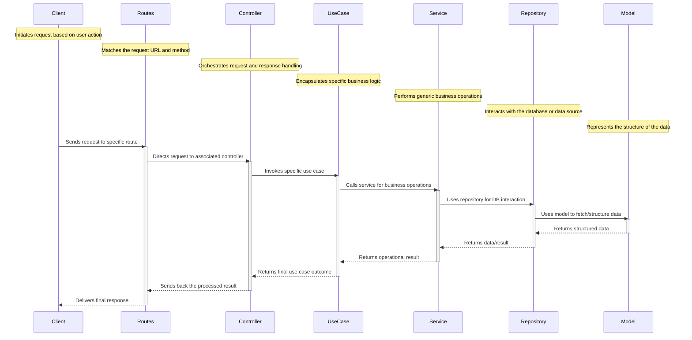

## List of features implemented
1. Custom logger - try bunyan
1. Middlewares  
    - security headers
    - request & response logging
    - response time
1. Database - Postgresql
    - Indexing
    - Full Text search  
1. Associations
    - `Sequelize` supports the standard associations: One-To-One, One-To-Many and Many-To-Many.
    - To do this, Sequelize provides four types of associations that should be combined to create them:
        1. The `HasOne` association
        1. The `BelongsTo` association
        1. The `HasMany` association
        1. The `BelongsToMany` association
    - Here's a tabular breakdown to map the standard relationships with their Sequelize functions:
        | Relationship Type | Source Model (A)       | Target Model (B)       | Notes/Comments                                             |
        |-------------------|------------------------|------------------------|------------------------------------------------------------|
        | One-To-One        | `A.hasOne(B)`          | `A.belongsTo(B)`       | Foreign key added to the target model (B).                 |
        | One-To-Many       | `A.hasMany(B)`         | `A.belongsTo(B)`       | Foreign key added to the target model (B).                 |
        | Many-To-Many      | `A.belongsToMany(B, { through: 'C' })` | `B.belongsToMany(A, { through: 'C' })` | Uses a junction table 'C'. Sequelize will auto-generate model C if not defined. |

    1. For **One-To-One** relationships:
        - The source model (A) has one target (B).
        - The target model (B) belongs to the source (A).
        - This effectively sets a foreign key in the target model (B) pointing to the source model (A).

    1. For **One-To-Many** relationships:
        - The source model (A) has many of the target (B).
        - Each target model (B) instance belongs to one source (A).
        - This effectively sets a foreign key in the target model (B) pointing to the source model (A).

    1. For **Many-To-Many** relationships:
        - Both models are related to each other using a junction table (often named 'C' or a more descriptive name).
        - This table 'C' holds foreign keys that point to the IDs in both the source (A) and target (B) models.

-  Associations: Albums - Songs - Artists 
    1. *Artist* - `Many-to-Many` - *Album* via junction table `artist_album`:
        ```js
         Artist.belongsToMany(Album, { through: ArtistAlbum });
         Album.belongsToMany(Artist, { through: ArtistAlbum });
        ```
    1. *Artist* - `Many-to-Many` - *Song* via junction table `artist_song`:
        ```js
        Artist.belongsToMany(Song, { through: ArtistSong });
        Song.belongsToMany(Artist, { through: ArtistSong });
        ```
    1. *Album* - `One-to-Many` - *Song*:
        ```js
        Album.hasMany(Song, { foreignKey: 'album_slug' });
        Song.belongsTo(Album, { foreignKey: 'album_slug' });
        ```
    1. SQL Query
        ```sql
            SELECT * FROM "Albums" JOIN "Songs" ON "Songs"."album_slug" = "Albums".slug;
        ```
        

1. use ORM - `sequelize` &  `sequelize-cli` to migrate & seed the data
    - update the config file to config.js to read from env variables
    - update `.sequelizerc`  to execute the sequelize cmds from any folder
        ```sh 
        # @~/coding/js_coding/backend/node-trailers/vermittler/database
        $ npx sequelize --help
        $ npx sequelize init
        $ npx sequelize-cli --version
        ```
    - `Creating the first Model (and Migration)`
        ```sh
        # @ ~/coding/js_coding/backend/node-trailers/vermittler
        # This will:
            # - Create a model file user in models folder;
            # - Create a migration file with name like XXXXXXXXXXXXXX-create-user.js in migrations folder.
        $ npx sequelize-cli model:generate --name User --attributes firstName:string,lastName:string,email:string
        # Artist model
        $ npx sequelize-cli model:generate --name Artist --attributes name:string,slug:string --force 
        # Song model
        $ npx sequelize-cli model:generate --name Song --attributes title:string,slug:string,summary:json,lyrics:json,native_lyrics:json
        # Album model
        $ npx sequelize-cli model:generate --name Album --attributes title:string,slug:string,language:string,year:integer

        ## ArtistAlbum model
            $ npx sequelize-cli model:generate --name ArtistAlbum --attributes artist_slug:string,album_slug:string

        # db:migrate will create the table in the database
        $ npx sequelize-cli db:migrate
        # db migrate specific migration
        $ npx sequelize-cli db:migrate --name 20230821084444-create-artist
        $ npx sequelize-cli db:migrate --name 20230827152309-create-song
        $ npx sequelize-cli db:migrate --name 20230827164349-create-album
        # undo the last migration
        $ npx sequelize-cli db:migrate:undo 
        # undo the specific migration
        $ npx sequelize-cli db:migrate:undo --name 20230817052134-create-user
        # This will create xxx-migration-skeleton.js in your migration folder
        $ npx sequelize-cli migration:generate --name <name_of_your_migration>
        ```
    - `Creating the first Seed`
        ```sh
            $ npx sequelize-cli seed:generate --name demo-user
            # This will create a seed file with name like XXXXXXXXXXXXXX-demo-user.js in seeders folder.
            $ npx sequelize-cli seed:generate --name demo-artist
            $ npx sequelize-cli seed:generate --name demo-song
            $ npx sequelize-cli seed:generate --name demo-album
        ```
     - Edit the seed file to insert a demo user
        ```sh
            # to run the seeds - commits to db
            $ npx sequelize-cli db:seed:all
            # to undo the seeds all, specific, most-recent
            $ npx sequelize-cli db:seed:undo:all
            $ npx sequelize-cli db:seed:undo --seed <name-of-seed-as-in-data>
            $ npx sequelize-cli db:seed:undo --seed 20230817052308-demo-user.js
            $ npx sequelize-cli db:seed --seed 20230817062507-demo-artist.js
            $ npx sequelize-cli db:seed --seed 20230827164825-demo-album.js
        ```
        - (TODO) use `queryInterface.sequelize.transaction` in migrations

1. Cache - Redis
1. Rate limiting
1. Authentication - jwt token
1. Authorization 
1. Unit tests
    - use of Mocha Framework
1. serve static files
1. template html
1. cookies & sessions
1. Docker
1. pm2 - use process manager to 
```sh
    # @~/cd
    $ pm2 reload ./ecosystem.config.js --only vermittler
    $ pm2 logs vermittler
    $ pm2 monit vermittler
    $ pm2 stop vermittler
```
1. eslint - linting
1. dotenv - environment variables
1. Clean architecture 
    - folder structure
    ```
       src/
        ├── app/
        │   ├── controllers/
        │   │   ├── blogPostController.js
        │   │   └── userController.js
        │   ├── middlewares/
        │   │   ├── authMiddleware.js
        │   │   └── errorMiddleware.js
        │   ├── routes/
        │   │   ├── blogPostRoutes.js
        │   │   └── userRoutes.js
        │   └── views/
        ├── config/
        │   ├── config.js
        │   └── database.js
        ├── core/
        │   ├── models/
        │   │   ├── BlogPost.js
        │   │   └── User.js
        │   ├── repositories/
        │   │   ├── BlogPostRepository.js
        │   │   └── UserRepository.js
        │   ├── services/
        │   │   ├── AuthService.js
        │   │   ├── BlogPostService.js
        │   │   └── UserService.js
        │   └── usecases/
        │       ├── AuthUseCases.js
        │       ├── BlogPostUseCases.js
        │       └── UserUseCases.js
        ├── database/
        │   ├── migrations/
        │   │   ├── 20220101000001-create-blog-post.js
        │   │   └── 20220101000002-create-user.js
        │   └── seeds/
        │       ├── 01-blog-posts.js
        │       └── 02-users.js
        └── interfaces/
            ├── http/
            │   ├── app.js
            │   └── server.js
            └── persistence/
                ├── BlogPostRepositoryImpl.js
                └── UserRepositoryImpl.js

    ```

    - Call flow in an clean architecture



### References
1. sequelize-cli 
    - https://sequelize.org/master/manual/migrations.html
    - https://youtu.be/M09nsCa4_Bk
    - https://youtu.be/4SySDaX753A
    - https://youtu.be/ikJ5AXDj3go
1. Sequelize
    - https://sequelize.org/docs/v6/category/core-concepts/
    - Associations 
        - https://sequelize.org/docs/v6/core-concepts/assocs/
        - https://sequelize.org/master/manual/assocs.html
    - Querying
        - https://levelup.gitconnected.com/using-the-sequelize-cli-and-querying-4ba8d0ac4314
1. pm2 
    - https://pm2.keymetrics.io/docs/usage/quick-start/
1. testing
    - https://dev-tester.com/dead-simple-api-tests-with-supertest-mocha-and-chai/